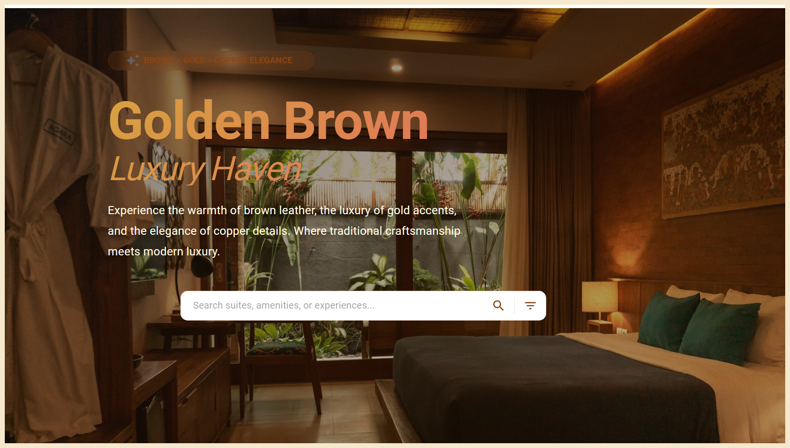

# Golden Brown Haven Hotel Management System

An individual full-stack hotel management system built with Spring Boot, React, MySQL, JWT authentication, role-based dashboards, booking management, room management, and AWS S3 image upload support.



## Project Overview

Golden Brown Haven is a hotel management web application that I built as an individual full-stack project. The project is focused on a real hotel booking flow: customers can register, log in, browse rooms, search available rooms by date and room type, create bookings, view booking history, and cancel bookings. On the admin side, the system provides room management, user/guest management, booking views, and dashboard analytics.

I built this project to practice connecting a React frontend with a Spring Boot backend in a more realistic way. Instead of only building static UI screens, I worked with authentication, protected API calls, database relationships, file upload handling, and dashboard data loading.

## Project Documents

I also added two PDF documents under the `docs` folder. The README gives the technical overview, while the PDFs provide a deeper explanation and visual walkthrough.

- [View Project Documentation PDF](./docs/project-documentation.pdf)
- [View UI Screenshots PDF](./docs/ui-screenshots.pdf)

## Tech Stack

| Layer | Technologies |
| --- | --- |
| Frontend | React 19, Vite, Material UI, MUI Icons, React Router DOM, Axios, Framer Motion, Recharts, Swiper, date-fns, MUI X Date Pickers |
| Backend | Java 21, Spring Boot 4.0.1, Spring Web MVC, Spring Security, Spring Data JPA, Spring Validation, Lombok |
| Database | MySQL, Hibernate/JPA |
| Authentication | Spring Security, BCrypt, JWT using `jjwt`, bearer token authorization |
| File / Media | Multipart file upload, AWS Java SDK S3 |
| Build / Tools | Maven, Maven Wrapper, npm, Vite, ESLint |

## Key Features

- **User Registration and Login** - Users can create accounts and log in using email and password.
- **JWT Authentication** - The backend returns a JWT after successful login, and the frontend sends it through the `Authorization` header for protected dashboard requests.
- **Role Based Dashboard Navigation** - The frontend redirects users to the admin or customer dashboard based on the role returned from the backend.
- **Customer Room Browsing** - Customers can view rooms, open room details, and search for available rooms.
- **Room Booking Flow** - Customers can book a selected room by providing check-in date, check-out date, guest count, and contact phone number.
- **Booking Confirmation Code** - The backend generates a random confirmation code when a booking is created.
- **My Bookings and Booking History** - Customers can view their active bookings and past booking history.
- **Booking Cancellation** - Customers can cancel bookings from the dashboard.
- **Admin Room Management** - Admin UI supports room creation, update, delete, and image upload.
- **Admin Booking and Guest Views** - Admin dashboard loads booking, room, and user data from the backend.
- **Dashboard Analytics** - The admin dashboard uses Recharts to display room, booking, revenue-style, and A/C vs non-A/C room analytics based on loaded data.
- **UI Feedback** - The frontend uses loading states, alerts, snackbars, dialogs, modals, and validation messages for user actions.

## Advanced Features

### JWT Based Authentication

I implemented login using Spring Security and JWT. After login, the backend generates a token using `JWTUtils`, and the frontend stores that token in `localStorage`. Dashboard API calls send the token as a bearer token.

### BCrypt Password Hashing

During registration, passwords are encoded using `BCryptPasswordEncoder` before saving users to the database. This keeps plain text passwords out of the database.

### Spring Security Filter Flow

`JWTAuthFilter` reads the `Authorization` header, extracts the username/email from the token, validates the token, loads the user through `UserDetailsService`, and sets the authenticated user in the Spring Security context.

### Method Level Authorization

Some backend methods use `@PreAuthorize` to restrict access by role. For example, admin-only methods are used for viewing all bookings, viewing all users, updating rooms, and deleting rooms. Booking creation and cancellation allow admin or normal user authorities.

### DTO and Response Layer

The backend does not return raw entities everywhere. I used DTO classes such as `UserDTO`, `RoomDTO`, `BookingDTO`, and a shared `Response` class to shape API responses in a cleaner way.

### Database Relationships

The main data model uses real JPA relationships:

- One `User` can have many `Booking` records.
- One `Room` can have many `Booking` records.
- Each `Booking` belongs to one `User` and one `Room`.

### Booking Availability Logic

When a user books a room, the backend checks existing bookings for the selected room and date range before saving the booking. The room availability search also compares check-in and check-out dates against existing booking records.

### AWS S3 Room Image Upload

Room creation and update support multipart image upload. The backend uses `AwsS3Service` with the AWS Java SDK to upload the image and store the returned image URL on the room record.

### Admin Analytics UI

The admin dashboard calculates chart data from loaded room and booking arrays. It includes room distribution, A/C vs non-A/C comparison, booking trends, revenue-style summaries, occupancy-style calculations, and Recharts visualizations.

### Responsive Dashboard UI

The frontend uses Material UI layouts, drawers, cards, dialogs, tables, tabs, modals, steppers, and responsive breakpoints. I also used Framer Motion for UI transitions and animated dashboard interactions.

## System Architecture

The project follows a simple full-stack architecture:

```txt
User / Browser
  |
  v
React + Vite Frontend
  |
  v
Axios HTTP Requests
  |
  v
Spring Boot REST Controllers
  |
  v
Service Layer / Business Logic
  |
  v
Spring Data JPA Repositories
  |
  v
MySQL Database
```

### Authentication Flow

```txt
Login Form
  |
  v
POST /auth/login
  |
  v
Spring Security AuthenticationManager
  |
  v
JWTUtils generates token
  |
  v
Frontend stores token and user data
  |
  v
Protected dashboard requests use Authorization: Bearer <token>
```

### Booking Flow

```txt
Customer selects room and dates
  |
  v
Frontend sends booking request
  |
  v
BookingService checks date range and room availability
  |
  v
Booking is saved with user and room relationship
  |
  v
Confirmation code is returned to frontend
```

### File Upload Flow

```txt
Admin selects room image
  |
  v
Frontend sends multipart/form-data
  |
  v
RoomController receives MultipartFile
  |
  v
AwsS3Service uploads image to S3
  |
  v
Room image URL is saved in MySQL
```

There is no WebSocket, Socket.IO, SSE, OTP, email verification, or forgot-password backend flow in the current codebase. Some UI text references future ideas, but I have only documented the features that are actually implemented.

## Folder Structure

```txt
springboot-Hotel-Management-System/
|
|-- backend/
|   |-- src/
|   |   |-- main/
|   |   |   |-- java/com/hms/HMS/
|   |   |   |   |-- controller/
|   |   |   |   |-- dto/
|   |   |   |   |-- entity/
|   |   |   |   |-- exception/
|   |   |   |   |-- repo/
|   |   |   |   |-- security/
|   |   |   |   |-- service/
|   |   |   |   `-- utils/
|   |   |   `-- resources/
|   |   |       |-- application.properties
|   |   |       `-- application-example.properties
|   |   `-- test/
|   |-- pom.xml
|   |-- mvnw
|   |-- mvnw.cmd
|   `-- .gitignore
|
|-- frontend/
|   `-- ui/
|       |-- src/
|       |   |-- Admin/
|       |   |-- Auth/
|       |   |-- Client/
|       |   |-- Home/
|       |   |-- assets/
|       |   |-- App.jsx
|       |   `-- main.jsx
|       |-- package.json
|       |-- package-lock.json
|       |-- vite.config.js
|       `-- eslint.config.js
|
|-- docs/
|   |-- project-documentation.pdf
|   |-- ui-screenshots.pdf
|   `-- images/
|       |-- landing-page-preview.png
|       `-- landing-page-original.png
|
|-- pom.xml
|-- .gitignore
`-- README.md
```

Folders such as `.idea`, `out`, `target`, `dist`, and `node_modules` are local IDE/build/dependency folders and should not be treated as the main source structure.

## Backend Overview

The backend is a Spring Boot application located inside the `backend` folder. It handles authentication, room data, bookings, user data, image upload, security filtering, and database persistence.

The main backend package is:

```txt
com.hms.HMS
```

### Controllers

- `AuthController` handles registration and login.
- `RoomController` handles room creation, room listing, room lookup, available room search, room update, and room delete.
- `BookingController` handles room booking, booking lookup by confirmation code, admin booking list, and booking cancellation.
- `UserController` handles all users, user lookup, user delete, logged-in profile info, and logged-in user's bookings.

### Services

- `UserService` handles registration, login, password encoding, JWT response data, user lookup, booking history, and user deletion.
- `RoomService` handles room CRUD logic, room availability filtering, and image upload through S3.
- `BookingService` handles booking creation, date validation, room availability checks, confirmation code generation, booking lookup, booking list, and cancellation.
- `CustomerUserDetailsService` loads users by email for Spring Security.
- `AwsS3Service` uploads room images to AWS S3.

### Repositories

- `UserRepository` provides user lookup by email and email existence checking.
- `RoomRepository` provides room access, distinct room type lookup, and available room queries.
- `BookingRepository` provides booking lookup by confirmation code, room id, and user id.

### Security

The backend uses Spring Security with stateless sessions. `JWTAuthFilter` validates bearer tokens, and `SecurityConfig` defines password encoding, authentication provider, CORS, session policy, and method-level security.

## Frontend Overview

The frontend is a React application inside `frontend/ui`. It uses Vite for local development and Material UI for most UI components.

Main routes are configured in `App.jsx`:

| Route | Page |
| --- | --- |
| `/` | Landing page |
| `/signup` | User registration page |
| `/login` | Login page |
| `/admin-home` | Admin dashboard |
| `/customer-home` | Customer dashboard |

### Frontend Pages

- `Home/home.jsx` contains the public landing page with hero section, search UI, animated sections, theme toggle, and visual hotel presentation.
- `Auth/signup.jsx` contains the multi-step registration form and calls `/auth/register`.
- `Auth/login.jsx` contains the login form and calls `/auth/login`.
- `Admin/AdminDashboard.jsx` contains admin dashboard views, room management, users/guests, bookings, analytics, profile, and settings UI.
- `Client/CustomerDashboard.jsx` contains customer room browsing, room details, booking modal, booking history, favorites, settings, and cancellation flow.

The landing page includes a local assistant-style UI widget, but it is not connected to an AI backend service in the current codebase.

## Database Overview

The backend uses MySQL with Spring Data JPA and Hibernate. The configured database name is `hotelDb`, and the current local configuration uses `createDatabaseIfNotExist=true`.

Main entities:

| Entity | Table | Purpose |
| --- | --- | --- |
| `User` | `users` | Stores customer/admin account data, role, hashed password, and linked bookings |
| `Room` | `rooms` | Stores room type, A/C type, price, capacity, image URL, description, and linked bookings |
| `Booking` | `bookings` | Stores booking dates, guest count, phone number, confirmation code, linked user, and linked room |

Important relationships:

- `User` has many `Booking` records.
- `Room` has many `Booking` records.
- `Booking` has one `User`.
- `Booking` has one `Room`.

## Authentication and Security

The current authentication flow covers registration, login, JWT generation, password hashing, token validation, and role-aware backend methods.

- **Registration** - Users register with name, email, phone number, password, and role. If no role is provided, the backend sets `ROLE_USER`.
- **Login** - The backend authenticates email and password using Spring Security and returns a JWT, role, and user DTO.
- **Password hashing** - Passwords are encoded using BCrypt before saving.
- **Token validation** - `JWTAuthFilter` validates the bearer token on incoming requests.
- **Role based access** - Several endpoints use `@PreAuthorize` with `ADMIN` and `ROLE_USER`.
- **Frontend token handling** - The frontend stores the token in `localStorage` and sends it in the `Authorization` header.
- **Logout** - The frontend logout clears token/user data from `localStorage`.

Sensitive configuration values such as database passwords, email app passwords, JWT secrets, and API keys should not be committed to GitHub. They should be stored locally using environment variables or ignored configuration files.

Current security limits:

- The project does not currently use HttpOnly cookies.
- OTP verification is not implemented.
- Email verification is not implemented.
- Forgot password and password update flows are not implemented in the backend.
- The JWT signing secret is currently defined in `JWTUtils`; it should be moved to external configuration before using this outside local development.

## Security and Configuration Notes

This project may require local configuration values such as database credentials, AWS credentials, JWT secrets, email app passwords, and other environment-specific settings.

To avoid exposing sensitive data, these files should not be pushed with real values:

- `.env`
- `application.properties`
- `application.yml`
- any local config file that contains passwords or secrets

Instead, keep safe example files such as:

- `.env.example`
- `application-example.properties`

I added this safe example file:

```txt
backend/src/main/resources/application-example.properties
```

If a sensitive file was already tracked by Git, remove it from Git tracking without deleting the local file:

```bash
git rm --cached path/to/file
```

Then add the file path to `.gitignore`.

This keeps the local project working while preventing private credentials from being pushed to GitHub.

## API Endpoints

This table is based on the current controller mappings in the backend.

### Auth Endpoints

| Method | Endpoint | Description | Auth Required |
| --- | --- | --- | --- |
| POST | `/auth/register` | Register a new user | No |
| POST | `/auth/login` | Log in and receive JWT token | No |

### Room Endpoints

| Method | Endpoint | Description | Auth Required |
| --- | --- | --- | --- |
| POST | `/rooms/add` | Add a new room with optional image upload | No method-level auth in current backend |
| GET | `/rooms/all` | Get all rooms | No |
| GET | `/rooms/types` | Get distinct room types | No |
| GET | `/rooms/room-by-id/{roomId}` | Get one room by id | ADMIN or ROLE_USER |
| GET | `/rooms/all-available-rooms` | Get currently available rooms | No |
| GET | `/rooms/available-rooms-by-date-and-type` | Search rooms by check-in date, check-out date, room type, and A/C type | No |
| PUT | `/rooms/update/{roomId}` | Update room details and optional image | ADMIN |
| DELETE | `/rooms/delete/{roomId}` | Delete room | ADMIN |

### Booking Endpoints

| Method | Endpoint | Description | Auth Required |
| --- | --- | --- | --- |
| POST | `/bookings/book-room/{roomId}/{userId}` | Book a room for a user | ADMIN or ROLE_USER |
| GET | `/bookings/all` | Get all bookings | ADMIN |
| GET | `/bookings/get-by-confirmation-code/{confirmationCode}` | Find booking by confirmation code | No |
| DELETE | `/bookings/cancel/{bookingId}` | Cancel a booking | ADMIN or ROLE_USER |

### User Endpoints

| Method | Endpoint | Description | Auth Required |
| --- | --- | --- | --- |
| GET | `/users/all` | Get all users | ADMIN |
| GET | `/users/get-by-id/{userId}` | Get user by id | Authenticated |
| DELETE | `/users/delete/{userId}` | Delete a user | Authenticated in current backend config |
| GET | `/users/get-logged-in-profile-info` | Get logged-in user's profile | Authenticated |
| GET | `/users/my-bookings` | Get logged-in user's booking history | Authenticated |

Note: I documented the current backend behavior as it exists in code. The admin UI sends a token for admin actions, but a few backend routes can still be tightened further with explicit `@PreAuthorize` rules.

## Installation and Setup Guide

### Prerequisites

- Java 21
- Maven or the included Maven Wrapper
- Node.js `^20.19.0` or `>=22.12.0` for the current Vite setup
- npm
- MySQL
- AWS S3 credentials if you want room image upload to work

### Clone the Repository

```bash
git clone <repo-url>
cd springboot-Hotel-Management-System
```

### Backend Setup

Create a local `application.properties` from the example file:

```bash
cp backend/src/main/resources/application-example.properties backend/src/main/resources/application.properties
```

Update the local `application.properties` with your own MySQL and AWS values. Do not commit real credentials.

Run the backend:

```bash
cd backend
./mvnw spring-boot:run
```

On Windows PowerShell:

```powershell
cd backend
.\mvnw.cmd spring-boot:run
```

Backend runs on:

```txt
http://localhost:8080
```

### Frontend Setup

```bash
cd frontend/ui
npm install
npm run dev
```

Frontend runs on:

```txt
http://localhost:5173
```

### Database Setup

The project uses MySQL. The configured database URL points to:

```txt
jdbc:mysql://localhost:3306/hotelDb
```

The URL includes `createDatabaseIfNotExist=true`, so MySQL can create `hotelDb` automatically if the configured user has permission.

Example local properties:

```properties
spring.datasource.url=jdbc:mysql://localhost:3306/hotelDb?createDatabaseIfNotExist=true&useSSL=false&serverTimezone=UTC
spring.datasource.username=your_mysql_username
spring.datasource.password=your_mysql_password
aws.s3.access.key=your_aws_access_key
aws.s3.secret.key=your_aws_secret_key
```

## UI Screenshots

The full UI walkthrough with screenshots and page explanations is available here:

- [View UI Screenshots PDF](./docs/ui-screenshots.pdf)

The PDF includes the landing page, signup, login, booking confirmation, room browsing, favorite rooms, my bookings, customer dashboard, admin dashboard, analytics, settings, profile, room management, guest management, and booking management screens.

## Project Documentation PDF

The project documentation PDF includes the complete technical overview, architecture flow, backend implementation notes, frontend implementation notes, database model, authentication and security details, setup notes, and a short UI preview.

- [View Project Documentation PDF](./docs/project-documentation.pdf)

I kept the README focused on setup, structure, APIs, and implementation details. The PDF gives a more visual explanation that is easier to share as project documentation.

## Challenges and What I Learned

While building this project, I improved my understanding of how a full-stack project should be connected end to end. The main learning areas for me were:

- Connecting React pages with Spring Boot REST APIs.
- Handling registration and login with Spring Security.
- Generating and validating JWT tokens.
- Structuring backend code using controllers, services, repositories, DTOs, and entities.
- Designing relationships between users, rooms, and bookings.
- Handling booking availability logic using date ranges.
- Uploading room images through multipart requests and AWS S3.
- Managing frontend state for dashboards, modals, loading states, and errors.
- Keeping sensitive configuration out of Git without breaking the local project.

This project also helped me see where a project needs stronger production-level work, especially around tests, backend route protection, deployment profiles, and secret management.

## Future Improvements

- Add backend and frontend test coverage for authentication, booking, room management, and API error cases.
- Move the JWT secret and AWS bucket configuration fully into environment-based configuration.
- Tighten role protection on routes such as room creation and user deletion.
- Add password update and forgot-password flows with email support.
- Improve validation messages and centralize backend exception handling.
- Add deployment configuration for separate development and production profiles.
- Replace hardcoded frontend API URLs with environment variables.
- Add better logging for authentication, booking, upload, and admin actions.

## About This Project

This project was built as my individual full-stack project to practice real application development with React, Spring Boot, MySQL, JWT authentication, role-based dashboards, database relationships, file upload handling, and dashboard UI work. It is not just a UI mockup; the customer and admin dashboards are connected to backend APIs and database operations.
